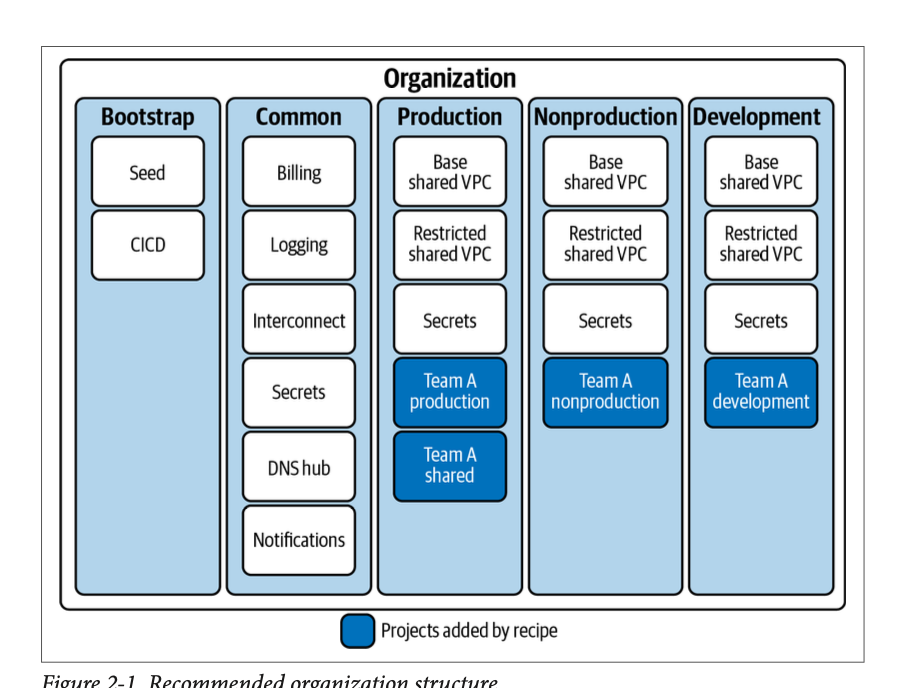

# C7 Clearing Project – Architecture Overview

## Landing Zone Layout (per diagram)

- **Bootstrap**: Seed and CI/CD bootstrapping. ArgoCD applications live here to manage itself and downstream stacks.
- **Common**: Shared foundation across all environments — billing/logging, ingress, monitoring, secrets, DNS hub, notifications.
- **Environments**: Production / Nonproduction / Development, each with shared VPCs, restricted VPCs, and per-team projects. Secrets are managed per environment.

## What’s in this repo

- **bootstrap/cicd/argocd**
  - ArgoCD self-managing Application (`application.yaml`) + variants (simple/advanced). Syncs ArgoCD via the Helm chart and local values.
- **common/services**
  - `ingress/ingress-nginx`: Ingress controller (NodePort by default for k3s).
  - `monitoring/kube-prometheus-stack`: Prometheus, Alertmanager, Grafana, exporters, ServiceMonitors.
  - `monitoring/goldilocks`: Resource recommendations (requires VPA).
  - `monitoring/vpa`: Vertical Pod Autoscaler CRDs/controllers.
  - `secrets/external-secrets`: External Secrets Operator (ESO) to sync from GCP Secret Manager into K8s Secrets.
  - `cicd/sonarqube`: SonarQube deployment (developer edition, monitoring passcode set).
- **environments/development/apps/trade-engine**
  - Helm chart + ArgoCD Application for the Trade Engine app.
  - ExternalSecret + ClusterSecretStore examples for pulling DB creds from GCP Secret Manager into `my-app-secret`.
  - Deployment consumes secrets via `envFrom` and Spring Boot reads them using `${SPRING_DATASOURCE_*}`.
- **apps/financial-app**
  - Spring Boot service code (trade engine) with datasource properties wired to env vars.
- **environments/development/infra**
  - Terraform/Ansible for the k3s VM and related infra (GCP). Terraform files include lifecycle guards to avoid unnecessary VM replacement.

## How secrets flow

1. Secrets are stored in **GCP Secret Manager** (e.g., `db-url`, `db-username`, `db-password`).
2. **External Secrets Operator** (common/services/secrets/external-secrets) syncs them into K8s as `my-app-secret` (see `clustersecretstore-gcp.yaml` and `externalsecret-example.yaml`).
3. The Trade Engine Deployment mounts `my-app-secret` via `envFrom`; Spring Boot reads `SPRING_DATASOURCE_URL/USERNAME/PASSWORD`.
4. To rotate secrets: add a new version in Secret Manager, let ESO sync, then restart the Deployment (or enable Spring Cloud K8s reload if you want live refresh).

## ArgoCD GitOps flow

- ArgoCD (self-managed app) lives in `bootstrap/cicd/argocd/application.yaml`.
- It syncs: ingress-nginx, monitoring stack, Goldilocks, VPA, External Secrets, SonarQube, and the Trade Engine app.
- For changes: update manifests/values in Git → ArgoCD syncs → cluster updates. Avoid committing secret key files (push protection is enabled).

## Access and operational notes

- Ingress is NodePort on k3s; use the VM IP + NodePort or port-forwarding for UIs (Grafana/Prometheus/ArgoCD/etc.).
- Goldilocks requires VPA CRDs; ensure the VPA app is synced.
- External Secrets CRDs must be present before applying ClusterSecretStore/ExternalSecret.
- Keep service account keys out of Git; use Secret Manager + ESO for runtime delivery.

## Quick pointers

- Restart app after secret changes (current env-var model): `sudo k3s kubectl -n trade-engine rollout restart deployment/trade-engine`.
- Verify Trade Engine app resources: `sudo k3s kubectl -n trade-engine get deployments,svc,ingress,secret,externalsecret`.
- ArgoCD UI status: ensure `argocd-self-managed` Application is applied in `argocd` namespace for self-management.
